# 🌱📦 biobox

**A curated collection of high-quality, production-ready bioinformatics
components**

Built with [Viash](https://viash.io), biobox provides reliable,
containerized tools for genomics and bioinformatics workflows. Each
component is thoroughly tested, fully documented, and designed for
seamless integration into both standalone and Nextflow pipelines.

## Why Choose biobox?

✅ **Production Ready**: All components are containerized with pinned
versions and comprehensive testing  
✅ **Nextflow Native**: Drop-in compatibility with Nextflow workflows  
✅ **Complete Documentation**: Full parameter exposure with detailed
help and examples  
✅ **Quality Assured**: Unit tested with automated CI/CD validation  
✅ **Modern Standards**: Built with current best practices and
maintained dependencies

## Featured Tools

Our collection spans the complete bioinformatics pipeline:

**Alignment & Mapping**: BWA, Bowtie2, STAR, Kallisto, Salmon  
**Quality Control**: FastQC, Falco, MultiQC, Qualimap, NanoPlot  
**Preprocessing**: Cutadapt, fastp, Trimgalore, UMI-tools  
**Variant Calling**: BCFtools, LoFreq, SnpEff  
**File Manipulation**: SAMtools, Bedtools, seqtk  
**Assembly & Annotation**: BUSCO, AGAT, GFFread  
**Single Cell**: CellRanger, BD Rhapsody

[View all components →](https://www.viash-hub.com/packages/biobox)

## Quick Start

You can run Viash components from biobox in several ways:

**🌐 Via Viash Hub Web UI**: Interactive interface with documentation
and examples  
**⚡ As Standalone Executables**: Direct command-line execution  
**🔄 Via Nextflow**: Local or cloud-based pipeline workflows

For detailed instructions on each method, visit the **[Viash Hub
documentation →](https://viash-hub.com/packages/biobox)** where each
component page shows exactly how to run it in different environments.

``` mermaid
flowchart LR
    A[biobox Components] --> B[🌐 Web UI]
    A --> C[⚡ Standalone]
    A --> D[🔄 Nextflow Local]
    A --> E[☁️ Nextflow Cloud]
    
    style A fill:#7a4baa,color:#fff
    style B fill:#e1f5fe,color:#000
    style C fill:#e8f5e8,color:#000
    style D fill:#fff3e0,color:#000
    style E fill:#f3e5f5,color:#000
```

You can run components directly from Viash Hub’s launch interface. See
[Viash Hub](https://www.viash-hub.com/packages/biobox) for more
information.

## Contributing

We welcome contributions! biobox thrives on community input to expand
our collection of high-quality bioinformatics components.

### Quick Contribution Process

1.  **Fork** the repository
2.  **Create** your component following our guidelines  
3.  **Test** thoroughly with `viash test`
4.  **Submit** a pull request

### What We’re Looking For

- **Popular bioinformatics tools** missing from our collection
- **Improvements** to existing components
- **Bug fixes** and documentation enhancements
- **Best practice** implementations

### Getting Started

Check out our comprehensive guides:

- **[Contributing
  Guidelines](https://github.com/viash-hub/biobox/blob/main/CONTRIBUTING.md)** -
  Complete development guide
- **[Component Standards](docs/COMPONENT_DEVELOPMENT.md)** - Quality
  requirements
- **[Testing Guide](docs/TESTING.md)** - Validation best practices

**New to Viash?** Start with our [beginner-friendly
issues](https://github.com/viash-hub/biobox/labels/good%20first%20issue)
or join our [community
discussions](https://github.com/viash-hub/biobox/discussions).

## Community & Support

- **Documentation**: [Viash Documentation](https://viash.io)
- **Discussions**: [GitHub
  Discussions](https://github.com/viash-hub/biobox/discussions)
- **Issues**: [Bug Reports & Feature
  Requests](https://github.com/viash-hub/biobox/issues)

------------------------------------------------------------------------

**Ready to streamline your bioinformatics workflows?** [Get started with
biobox today →](https://www.viash-hub.com/packages/biobox)
