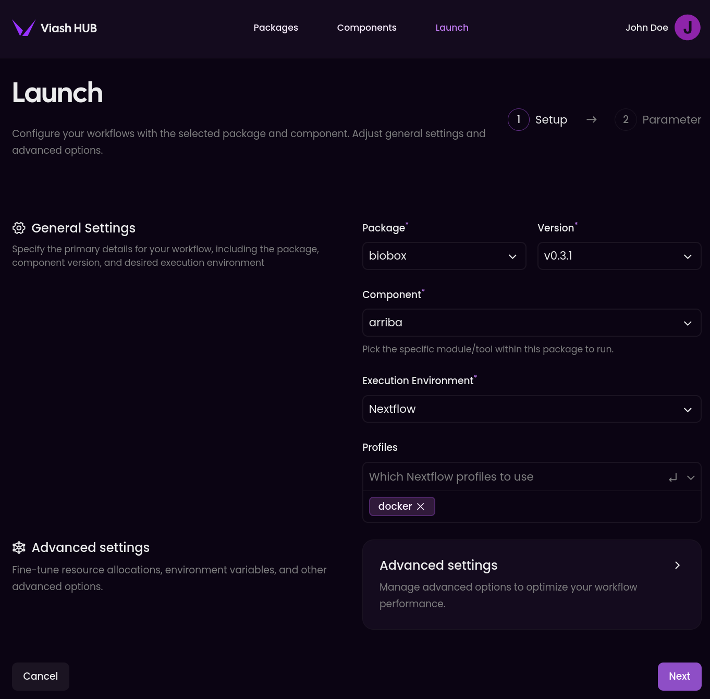

# 🌱📦 biobox

[](https://www.viash-hub.com/packages/biobox)
[](https://github.com/viash-hub/biobox)
[](https://github.com/viash-hub/biobox/blob/main/LICENSE)
[](https://github.com/viash-hub/biobox/issues)
[](https://viash.io)

A curated collection of high-quality, standalone bioinformatics
components built with [Viash](https://viash.io).

## Introduction

`biobox` offers a suite of reliable bioinformatics components, similar
to [nf-core/modules](https://github.com/nf-core/modules) and
[snakemake-wrappers/bio](https://github.com/snakemake/snakemake-wrappers/tree/master/bio),
but built using the [Viash](https://viash.io) framework.

This approach emphasizes **reusability**, **reproducibility**, and
adherence to **best practices**. Key features of `biobox` components
include:

- **Standalone & Nextflow Ready:** Run components directly via the
  command line or seamlessly integrate them into Nextflow workflows.
- **High Quality Standards:**
  - Comprehensive documentation for components and parameters.
  - Full exposure of underlying tool arguments.
  - Containerized (Docker) for dependency management and
    reproducibility.
  - Unit tested for verified functionality.

## Example Usage

Viash components in biobox can be run in various ways:


### 1. Via the Viash Hub Launch interface

You can run this component directly from the Viash Hub [Launch
interface](https://www.viash-hub.com/launch?package=biobox&version=v0.3.0&component=arriba&runner=Executable).



### 2. Via the Viash CLI

You can run this component directly from the command line using the
Viash CLI.

``` bash
viash run vsh://biobox@v0.3.0/arriba -- --help

viash run vsh://biobox@v0.3.0/arriba -- \
  --bam path/to/input.bam \
  --genome path/to/genome.fa \
  --gene_annotation path/to/annotation.gtf \
  --fusions path/to/output.txt
```

This will run the component with the specified input files and output
the results to the specified output file.

### 3. Via the Nextflow CLI or Seqera Cloud

You can run this component as a Nextflow pipeline.

``` bash
nextflow run https://packages.viash-hub.com/vsh/biobox \
  -revision v0.3.0 \
  -main-script target/nextflow/arriba/main.nf \
  -latest -resume \
  -profile docker \
  --bam path/to/input.bam \
  --genome path/to/genome.fa \
  --gene_annotation path/to/annotation.gtf \
  --publish_dir path/to/output
```

**Note:** Make sure that the [Nextflow
SCM](https://www.nextflow.io/docs/latest/git.html#git-configuration) is
set up properly. You can do this by adding the following lines to your
`~/.nextflow/scm` file:

``` groovy
providers.vsh.platform = 'gitlab'
providers.vsh.server = 'https://packages.viash-hub.com'
```

**Tip:** This will also work with Seqera Cloud or other
Nextflow-compatible platforms.

### 4. As a dependency

In your Viash config file (`config.vsh.yaml`), you can add this
component as a dependency:

``` yaml
dependencies:
  - name: arriba
    repository: vsh://biobox@v0.3.0
```

## Contributing

Contributions are welcome! We aim to build a comprehensive collection of
high-quality bioinformatics components. If you’d like to contribute,
please follow these general steps:

1.  Find a component to contribute
2.  Add config template
3.  Fill in the metadata
4.  Find a suitable container
5.  Create help file
6.  Create or fetch test data
7.  Add arguments for the input files
8.  Add arguments for the output files
9.  Add arguments for the other arguments
10. Add a Docker engine
11. Write a runner script
12. Create test script
13. Create a `/var/software_versions.txt` file

See the
[CONTRIBUTING](https://github.com/viash-hub/biobox/blob/main/CONTRIBUTING.md)
file for more details.
